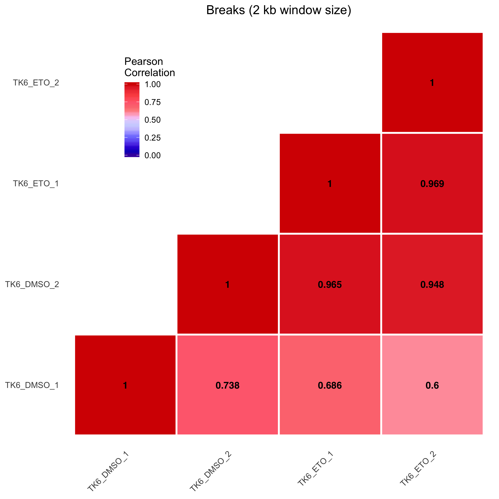
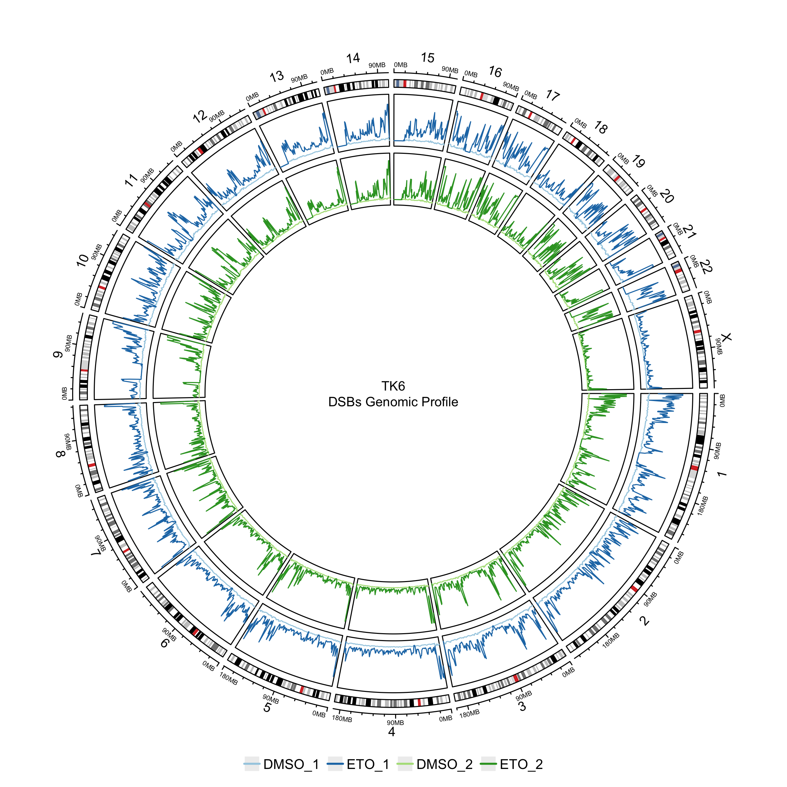

Tutorial on BLISS Downstream Analysis (human)
================

## BLISS Downstream Analysis (Human)

Load the required packages:

``` r
require("GenomicFeatures")
require("AnnotationHub")
require("biomaRt")
require("rtracklayer")
require("data.table")
require("knitr")
require("ggplot2")
require("ggpubr")
require("ggsci")
require("circlize")
```

Define some analysis variables and functions:

``` r
# Genome assembly
genome = "hg19"
# ENSEMBL annotation species
species = "hsapiens_gene_ensembl"
# ENSEMBL annotation repository (corresponding to version 75) 
annotation = "http://feb2014.archive.ensembl.org"
# List of blacklisted regions (obtained from 'https://github.com/Boyle-Lab/Blacklist/tree/master/lists')
blacklist = "hg19-blacklist.v2.bed.gz"

# A countOverlaps function with 'Union' mode, which takes into account the 'score' column
countOverlapsWeighted <- function(query, subject, keepAmbiguous=FALSE){
    overlaps = as.data.table(findOverlaps(query, subject))
    overlaps[, N := .N, by="subjectHits"]
    if( !keepAmbiguous ) # Whether or not to retain reads that overlap multiple features
        overlaps = overlaps[N == 1,]
    setkey(overlaps, subjectHits)
    tmp = data.table(as.data.frame(subject), index = seq_along(subject), key="index")
    overlaps[tmp, score := score/N]
    setkey(overlaps, queryHits)
    overlaps = overlaps[, .(score = sum(score)), by=key(overlaps)]
    tmp = data.table(as.data.frame(query), index = seq_along(query), key="index")
    tmp = merge.data.table(tmp, overlaps, by.x=key(tmp), by.y=key(overlaps), all.x=TRUE)
    tmp[is.na(score), score := 0]
    return(tmp[, score])
}
```

Prepare the sample table, which will be our internal reference, and make
sure the paths and filenames are correct:

``` r
sampleTable = data.table(name = c("BB61_DMSO_1", "BB62_DMSO_2", "BB61_ETO_1", "BB62_ETO_2"),
                         Experiment = c("BB61", "BB62", "BB61", "BB62"),
                         Treatment = c("DMSO", "DMSO", "ETO", "ETO"),
                         Replicate = c("1", "2", "1", "2"),
                         path=c("./data/BB61_TK6DMSOrep1_CATCACGC_chr-loc-countDifferentUMI.bed.gz",
                                "./data/BB62_TK6DMSOrep2_CATCACGC_chr-loc-countDifferentUMI.bed.gz",
                                "./data/BB61_TK6ETOrep1_GTCGTCGC_chr-loc-countDifferentUMI.bed.gz",
                                "./data/BB62_TK6ETOrep2_GTCGTCGC_chr-loc-countDifferentUMI.bed.gz"))
```

Load blacklist regions and BLISS DSBs files:

``` r
# Load the blacklist file
blacklist = fread(cmd=paste("gunzip -c", blacklist), select=1:3, col.names=c("seqnames", "start", "end"))

# Transform chromosome names, and coordinates to 1-based
blacklist[, `:=`(seqnames = gsub("chr", "", seqnames),  start = start+1, end = end+1)]
setkeyv(blacklist, colnames(blacklist))

# Load the BLISS samples
data = lapply(with(sampleTable, setNames(path, name)), 
              function(x){
                  tmp = fread(cmd=paste("gunzip -c", x), showProgress=FALSE,
                              col.names=c("seqnames", "start", "end", "score"),
                              colClasses=c("character", "numeric", "numeric", "numeric"))
                  setkeyv(tmp, c("seqnames", "start", "end"))
                  # Filter out DSBs falling within blacklisted regions
                  tmp2 = fsetdiff(tmp[, 1:3, with=FALSE], blacklist)
                  tmp2[tmp, score := score]
                  return(tmp2)
              })
```

Calculate the distribution of DSB events at different thresholds (in
this example, from 1 to 10):

``` r
breaks = 1:10
pl = rbindlist(data, idcol="name")
pl = pl[, lapply(breaks, function(x) .SD[score>=x, .N]), by="name"]
pl = melt.data.table(pl, id.vars="name")
pl[, variable := as.numeric(gsub("V", "", variable))]
pl[, c("Experiment", "Treatment", "Replicate") := tstrsplit(name, "_")]

fig1a = ggplot(pl, aes(x=variable, y=value, col=Treatment, shape=Replicate)) +
    ggtitle("TK6 Cells") +
    geom_point(size=3) + geom_line(lwd=0.75) +
    scale_x_continuous("at least # UMIs per location", breaks=breaks) +
    scale_y_log10("DSB locations") +
    scale_colour_npg() +
    theme_bw() + theme(plot.title=element_text(hjust=0.5))
ggsave(fig1a, filename=file.path("images", "fig1a_human.png"), units="in", width=8, height=8, dpi=300)
```


Dynamically retrieve from ENSEMBL the chromosome lengths and bin the
genome into 2 kb windows:

``` r
chrom_sizes = getChromInfoFromBiomart(biomart="ENSEMBL_MART_ENSEMBL",
                                      dataset=species,
                                      host=annotation)
```

    ## Download and preprocess the 'transcripts' data frame ... OK
    ## Download and preprocess the 'chrominfo' data frame ... OK

``` r
chrom_sizes = with(chrom_sizes, Seqinfo(seqnames=as.character(chrom), seqlengths=length, isCircular=NA, genome=genome))
chrom_sizes = keepStandardChromosomes(chrom_sizes)

# Genome binning
window_size = 1e5
genomic_tiles = tileGenome(seqlengths(chrom_sizes), tilewidth=window_size, cut.last.tile.in.chrom=TRUE)
# Remove windows that are smaller than the window size (i.e., the last window at the end of each chromosome)
genomic_tiles = genomic_tiles[width(genomic_tiles)==window_size]
```

Count the DSB events in each bin and plot the correlation between
samples:

``` r
pl = sapply(data,
            function(x)
                countOverlapsWeighted(genomic_tiles,
                                      with(x, GRanges(seqnames, IRanges(start, width=1), score=score))))

# Correlation using all non-empty bins
pl = cor(pl[rowSums(pl)>0,], method="pearson", use="pairwise.complete.obs")

pl[lower.tri(pl)] = NA

pl = melt.data.table(data.table(pl, keep.rownames = "Row"),
                     id.vars = "Row", variable.name = "Col", value.name = "Value")

pl[, Col := factor(Col, levels = sampleTable[, name])]
pl[, Row := factor(Row, levels = sampleTable[, name])]

fig1b = ggplot(pl, aes(x = Col, y = Row)) +
    ggtitle("Breaks (2 kb window size)") +
    geom_tile(data = subset(pl, !is.na(Value)), aes(fill = Value), col="white", lwd=1) +
    geom_tile(data = subset(pl, is.na(Value)), fill = "white") +
    scale_fill_gsea(name="Pearson\nCorrelation", limits=c(0,1)) +
    geom_text(aes(label=round(Value, 3), family="Helvetica", fontface="bold")) +
    theme_pubclean() +
    theme(plot.title=element_text(hjust=0.5), legend.position=c(0.2, 0.8),
          axis.ticks=element_blank(), panel.grid=element_blank(), axis.title=element_blank(),
          axis.text.x=element_text(angle=45, hjust=1))
ggsave(fig1b, filename=file.path("images", "fig1b_human.png"), units="in", width=8, height=8, dpi=300)
```



Dynamically retrieve from ENSEMBL the gene annotation and create the
GRanges object:

``` r
ensembl = useEnsembl(biomart="ENSEMBL_MART_ENSEMBL",
                     dataset=species,
                     host=annotation)
genes <- getBM(attributes=c('chromosome_name','start_position','end_position', 'strand', 'gene_biotype', 'ensembl_gene_id'),
               filters = 'chromosome_name', values = seqnames(chrom_sizes), mart = ensembl)
# Create the GRanges object
genes_gr = with(genes, GRanges(chromosome_name, IRanges(start_position, end_position), strand = ifelse(strand>0, "+", "-"),
                               biotype=gene_biotype, gene_id = ensembl_gene_id))
```

Calculate the distribution of DSB events across genic and intergenic
portions of the genome:

``` r
pl = sapply(data,
            function(x)
                countOverlapsWeighted(genes_gr,
                                      with(x, GRanges(seqnames, IRanges(start, width=1), score=score)), keepAmbiguous=TRUE))
pl = data.table(as.data.frame(genes_gr), pl)

pl = melt.data.table(pl, id.vars="biotype", measure.vars=sampleTable[, name])

# Collapse the counts by biotype
pl = pl[, .(value = sum(value)), by=c("variable", "biotype")]

# Add the promoter and intergenic counts
pl_extra = rbindlist(lapply(seq_along(data),
                            function(i){
                                tmp = with(data[[i]], GRanges(seqnames, IRanges(start, width=1), score=score))
                                tmp = tmp[!overlapsAny(tmp, genes_gr),]
                                prom = promoters(genes_gr, upstream=2e3, downstream=1)
                                count = sum(countOverlapsWeighted(prom, tmp))
                                data.table(variable = names(data)[i],
                                           biotype = c("promoter", "intergenic"),
                                           value = as.numeric(c(count, sum(tmp$score)-count)))
                            }))

pl = rbindlist(list(pl, pl_extra))

# Calculate the fractions per dataset 
pl[, percentage := value/sum(value), by="variable"]

# Collapse the minor biotypes into the 'other' group
pl[!biotype%in%c("promoter", "protein_coding", "lincRNA", "intergenic"), biotype := "other"]

pl = pl[, .(value=sum(value), percentage=sum(percentage)), by=c("variable", "biotype")]

pl[, biotype := factor(biotype, levels=c("promoter", "protein_coding", "lincRNA", "other", "intergenic"))]

pl[order(biotype), position := cumsum(percentage)- 0.5*percentage, by="variable"]

fig1c = ggplot(pl, aes(x=as.factor(1), y=percentage, fill=biotype)) +
    geom_bar(stat="identity", position="stack", col="black") +
    scale_fill_npg(name="") +
    geom_text(aes(y=1-position, label=paste0(round(percentage*100, 1), "%"), x=1.65)) +
    facet_wrap(~variable) +
    theme_void() +
    coord_polar(theta="y", direction=-1)
ggsave(fig1c, filename=file.path("images", "fig1c_human.png"), units="in", width=8, height=8, dpi=300)
```


Visualise the density of DSB events across the genome:

``` r
# genomic_tiles = tileGenome(seqlengths(chrom_sizes), tilewidth=1e6, cut.last.tile.in.chrom=TRUE)
# 
# pl = lapply(data,
#             function(x)
#                 data.table(as.data.frame(genomic_tiles),
#                            count = countOverlapsWeighted(genomic_tiles,
#                                                          with(x, GRanges(seqnames, IRanges(start, width=1), score=score)))))

pl = data
for( i in seq_along(pl) ){
    pl[[i]] = pl[[i]][seqnames%in%c(1:22, "X")]
    # pl[[i]][score>100, score := 100]
}

png(filename=file.path("images", "fig1d_human.png"), units="in", width=8, height=8, res=300)
    circos.initializeWithIdeogram(species = genome, chromosome.index = paste0("chr", c(1:22, "X")))
    i = 1
    for( treatment in sampleTable[, rev(unique(Treatment))] ){
        ii = 1
        sel_col = get_palette("Paired", i*2)
        sel_col = sel_col[((i-1)*2+1):(i*2)]
        for( name in sampleTable[Treatment==treatment, name] ){
            circos.trackHist(with(pl[[name]], rep(paste0("chr", seqnames), score)), with(pl[[name]], rep(start, score)),
                             bin.size=1e6, col = sel_col[ii], track.height = 0.1, track.index=i+2, draw.density=TRUE, area=FALSE)
            ii = ii+1
        }
        i = i+1
    }
    text(0, 0, "TK6\nDSBs Genomic Profile", cex = 0.8)
    circos.clear()
dev.off()
```

    ## pdf 
    ##   2


