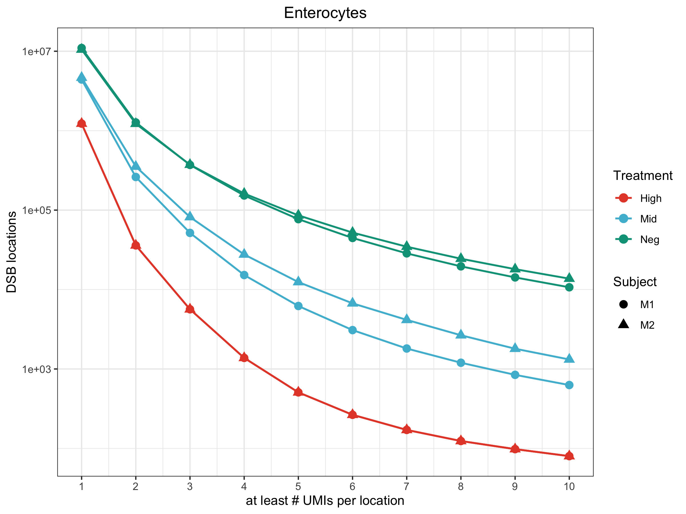
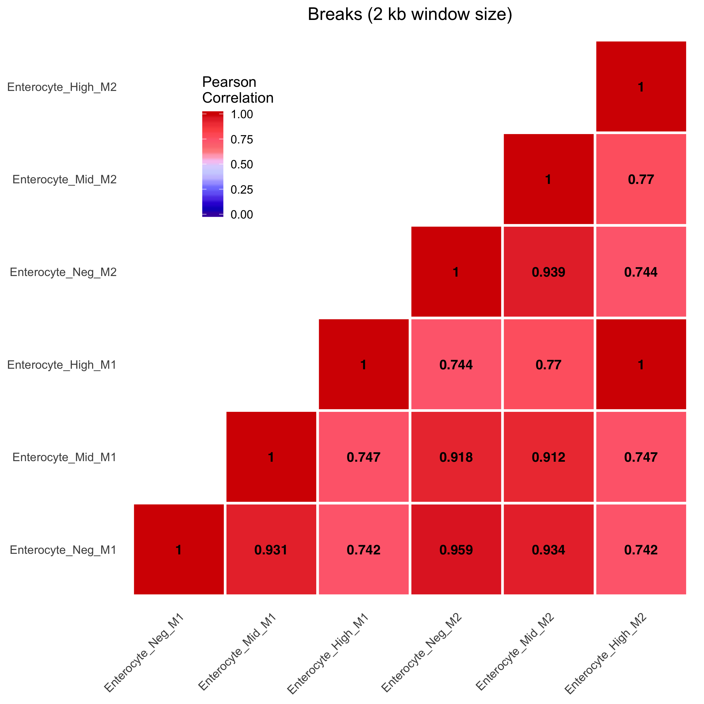
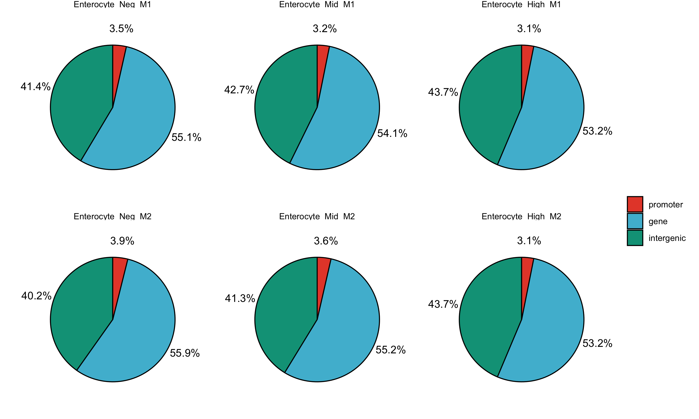
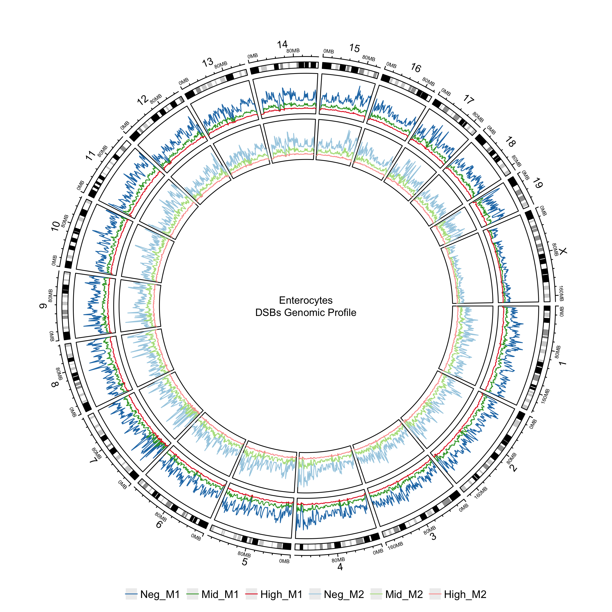
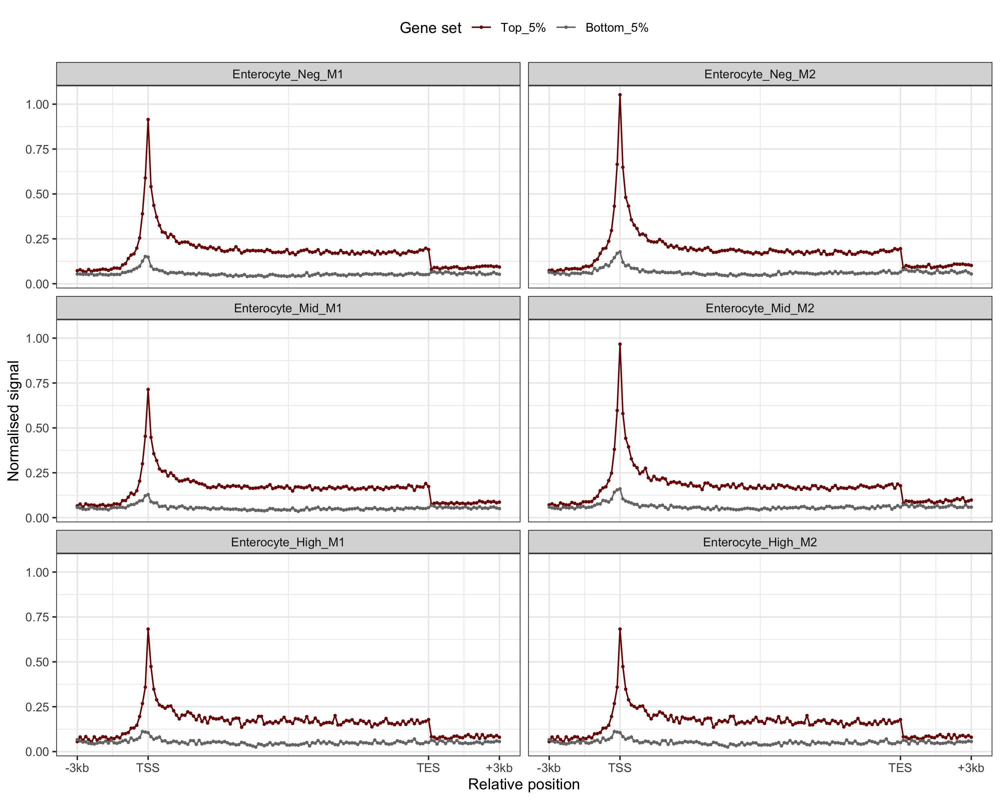
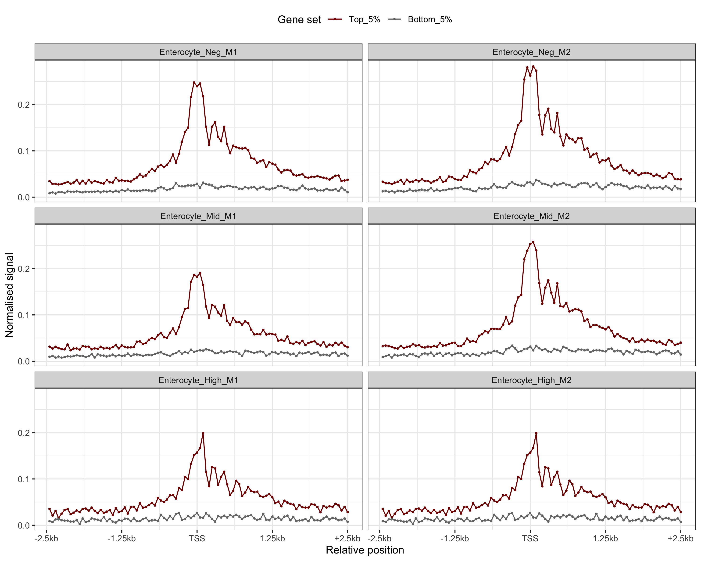

Tutorial on BLISS Downstream Analysis (mouse)
================

Load the required packages:

``` r
require("GenomicFeatures")
require("AnnotationHub")
require("biomaRt")
require("rtracklayer")
require("data.table")
require("knitr")
require("ggplot2")
require("ggpubr")
require("ggsci")
require("circlize")
```

Define some analysis variables and functions:

``` r
# Genome assembly
genome = "mm10"
# ENSEMBL annotation species
species = "mmusculus_gene_ensembl"
# ENSEMBL annotation repository (corresponding to version 90) 
annotation = "http://aug2017.archive.ensembl.org"
# List of blacklisted regions (obtained from 'https://github.com/Boyle-Lab/Blacklist/tree/master/lists')
blacklist = "mm10-blacklist.v2.bed.gz"

chromosomes = c(1:19, "X")

# A countOverlaps function with 'Union' mode, which takes into account the 'score' column
countOverlapsWeighted <- function(query, subject, keepAmbiguous=FALSE){
    overlaps = as.data.table(findOverlaps(query, subject))
    overlaps[, N := .N, by="subjectHits"]
    if( !keepAmbiguous ) # Whether or not to retain reads that overlap multiple features
        overlaps = overlaps[N == 1,]
    setkey(overlaps, subjectHits)
    tmp = data.table(as.data.frame(subject), index = seq_along(subject), key="index")
    overlaps[tmp, score := score/N]
    setkey(overlaps, queryHits)
    overlaps = overlaps[, .(score = sum(score)), by=key(overlaps)]
    tmp = data.table(as.data.frame(query), index = seq_along(query), key="index")
    tmp = merge.data.table(tmp, overlaps, by.x=key(tmp), by.y=key(overlaps), all.x=TRUE)
    tmp[is.na(score), score := 0]
    return(tmp[, score])
}
```

Prepare the sample table, which will be our internal reference, and make
sure the paths and filenames are correct:

``` r
sampleTable = data.table(name = c("BB70_neg_rep1", "BB70_mid_rep1", "BB70_high_rep1","BB72_neg_rep2", "BB72_mid_rep2", "BB72_high_rep2"),
                         Experiment = rep(c("BB70", "BB72"), each=3),
                         Treatment = rep(c("neg", "mid", "high"), 2),
                         Replicate = rep(c("1", "2"), each=3),
                         path=c("./data/BB70_CD73negM1E2911_GTCGTCGC_chr-loc-countDifferentUMI.bed.gz",
                                "./data/BB70_CD73midM1E2911_ACGACCGC_chr-loc-countDifferentUMI.bed.gz",
                                "./data/BB70_CD73highM1E2911_TGATGCGC_chr-loc-countDifferentUMI.bed.gz",
                                "./data/BB72_CD73negM2E2911_GTCGTCGC_chr-loc-countDifferentUMI.bed.gz",
                                "./data/BB72_CD73midM2E2911_ACGACCGC_chr-loc-countDifferentUMI.bed.gz",
                                "./data/BB72_CD73highM2E2911_TGATGCGC_chr-loc-countDifferentUMI.bed.gz"))
```

Load blacklist regions and BLISS DSBs files:

``` r
# Load the blacklist file
blacklist = fread(cmd=paste("gunzip -c", blacklist), select=1:3, col.names=c("seqnames", "start", "end"))

# Transform chromosome names, and coordinates to 1-based
blacklist[, `:=`(seqnames = gsub("chr", "", seqnames),  start = start+1, end = end+1)]
setkeyv(blacklist, colnames(blacklist))

# Load the BLISS samples
data = lapply(with(sampleTable, setNames(path, name)), 
              function(x){
                  tmp = fread(cmd=paste("gunzip -c", x), showProgress=FALSE,
                              col.names=c("seqnames", "start", "end", "score"),
                              colClasses=c("character", "numeric", "numeric", "numeric"))
                  setkeyv(tmp, c("seqnames", "start", "end"))
                  tmp[seqnames==20, seqnames := "X"][seqnames==21, seqnames := "Y"][seqnames==22, seqnames := "MT"]
                  tmp = tmp[seqnames%in%chromosomes,]
                  # Filter out DSBs falling within blacklisted regions
                  tmp2 = fsetdiff(tmp[, 1:3, with=FALSE], blacklist)
                  tmp2[tmp, score := score]
                  return(tmp2)
              })
```

Calculate the distribution of DSB events at different thresholds (in
this example, from 1 to 10):

``` r
breaks = 1:10
pl = rbindlist(data, idcol="name")
pl = pl[, lapply(breaks, function(x) .SD[score>=x, .N]), by="name"]
pl = melt.data.table(pl, id.vars="name")
pl[, variable := as.numeric(gsub("V", "", variable))]
pl[, c("Experiment", "Treatment", "Replicate") := tstrsplit(name, "_")]

fig1a = ggplot(pl, aes(x=variable, y=value, col=Treatment, shape=Replicate)) +
    ggtitle("CD73 Cells") +
    geom_point(size=3) + geom_line(lwd=0.75) +
    scale_x_continuous("at least # UMIs per location", breaks=breaks) +
    scale_y_log10("DSB locations") +
    scale_colour_npg() +
    theme_bw() + theme(plot.title=element_text(hjust=0.5))
ggsave(fig1a, filename=file.path("images", "fig1a_mouse.png"), units="in", width=8, height=6, dpi=300)
```



Dynamically retrieve from ENSEMBL the chromosome lengths and bin the
genome into 2 kb windows:

``` r
chrom_sizes = getChromInfoFromBiomart(biomart="ENSEMBL_MART_ENSEMBL",
                                      dataset=species,
                                      host=annotation)
```

    ## Download and preprocess the 'transcripts' data frame ... OK
    ## Download and preprocess the 'chrominfo' data frame ... OK

``` r
chrom_sizes = with(chrom_sizes, Seqinfo(seqnames=as.character(chrom), seqlengths=length, isCircular=NA, genome=genome))
chrom_sizes = keepSeqlevels(chrom_sizes, chromosomes)

# Genome binning
window_size = 2e3
genomic_tiles = tileGenome(seqlengths(chrom_sizes), tilewidth=window_size, cut.last.tile.in.chrom=TRUE)
# Remove windows that are smaller than the window size (i.e., the last window at the end of each chromosome)
genomic_tiles = genomic_tiles[width(genomic_tiles)==window_size]
```

Count the DSB events in each bin and plot the correlation between
samples:

``` r
pl = sapply(data,
            function(x)
                countOverlapsWeighted(genomic_tiles,
                                      with(x, GRanges(seqnames, IRanges(start, width=1), score=score))))

# Correlation using all non-empty bins
pl = cor(pl[rowSums(pl)>0,], method="pearson", use="pairwise.complete.obs")

pl[lower.tri(pl)] = NA

pl = melt.data.table(data.table(pl, keep.rownames = "Row"),
                     id.vars = "Row", variable.name = "Col", value.name = "Value")

pl[, Col := factor(Col, levels = sampleTable[, name])]
pl[, Row := factor(Row, levels = sampleTable[, name])]

fig1b = ggplot(pl, aes(x = Col, y = Row)) +
    ggtitle("Breaks (2 kb window size)") +
    geom_tile(data = subset(pl, !is.na(Value)), aes(fill = Value), col="white", lwd=1) +
    geom_tile(data = subset(pl, is.na(Value)), fill = "white") +
    scale_fill_gsea(name="Pearson\nCorrelation", limits=c(0,1)) +
    geom_text(aes(label=round(Value, 3), family="Helvetica", fontface="bold")) +
    theme_pubclean() +
    theme(plot.title=element_text(hjust=0.5), legend.position=c(0.2, 0.8),
          axis.ticks=element_blank(), panel.grid=element_blank(), axis.title=element_blank(),
          axis.text.x=element_text(angle=45, hjust=1))
ggsave(fig1b, filename=file.path("images", "fig1b_mouse.png"), units="in", width=8, height=8, dpi=300)
```



Dynamically retrieve from ENSEMBL the gene annotation and create the
GRanges object:

``` r
ensembl = useEnsembl(biomart="ENSEMBL_MART_ENSEMBL",
                     dataset=species,
                     host=annotation)
genes <- getBM(attributes=c('chromosome_name','start_position','end_position', 'strand', 'gene_biotype', 'ensembl_gene_id'),
               filters = 'chromosome_name', values = seqnames(chrom_sizes), mart = ensembl)
# Create the GRanges object
genes_gr = with(genes, GRanges(chromosome_name, IRanges(start_position, end_position), strand = ifelse(strand>0, "+", "-"),
                               biotype=gene_biotype, gene_id = ensembl_gene_id))
```

Calculate the distribution of DSB events across genic and intergenic
portions of the genome:

``` r
pl = sapply(data,
            function(x)
                countOverlapsWeighted(genes_gr,
                                      with(x, GRanges(seqnames, IRanges(start, width=1), score=score)), keepAmbiguous=TRUE))
pl = data.table(as.data.frame(genes_gr), pl)

pl = melt.data.table(pl, id.vars="biotype", measure.vars=sampleTable[, name])

# Collapse the counts by biotype
pl = pl[, .(value = sum(value)), by=c("variable", "biotype")]

# Add the promoter and intergenic counts
pl_extra = rbindlist(lapply(seq_along(data),
                            function(i){
                                tmp = with(data[[i]], GRanges(seqnames, IRanges(start, width=1), score=score))
                                tmp = tmp[!overlapsAny(tmp, genes_gr),]
                                prom = promoters(genes_gr, upstream=2e3, downstream=1)
                                count = sum(countOverlapsWeighted(prom, tmp))
                                data.table(variable = names(data)[i],
                                           biotype = c("promoter", "intergenic"),
                                           value = as.numeric(c(count, sum(tmp$score)-count)))
                            }))

pl = rbindlist(list(pl, pl_extra))

# Calculate the fractions per dataset 
pl[, percentage := value/sum(value), by="variable"]

# Collapse the minor biotypes into the 'other' group
# pl[!biotype%in%c("promoter", "protein_coding", "lincRNA", "intergenic"), biotype := "other"]
pl[!biotype%in%c("promoter", "intergenic"), biotype := "gene"]

pl = pl[, .(value=sum(value), percentage=sum(percentage)), by=c("variable", "biotype")]

# pl[, biotype := factor(biotype, levels=c("promoter", "protein_coding", "lincRNA", "other", "intergenic"))]
pl[, biotype := factor(biotype, levels=c("promoter", "gene", "intergenic"))]

pl[order(biotype), position := cumsum(percentage)- 0.5*percentage, by="variable"]

fig1c = ggplot(pl, aes(x=as.factor(1), y=percentage, fill=biotype)) +
    geom_bar(stat="identity", position="stack", col="black") +
    scale_fill_npg(name="") +
    geom_text(aes(y=1-position, label=paste0(round(percentage*100, 1), "%"), x=1.7)) +
    facet_wrap(~variable) +
    theme_void() +
    coord_polar(theta="y", direction=-1)
ggsave(fig1c, filename=file.path("images", "fig1c_mouse.png"), units="in", width=10, height=6, dpi=300)
```



Visualise the density of DSB events across the genome:

``` r
genomic_tiles = tileGenome(seqlengths(chrom_sizes), tilewidth=1e6, cut.last.tile.in.chrom=TRUE)

pl = lapply(data,
            function(x)
                data.table(as.data.frame(genomic_tiles),
                           count = countOverlapsWeighted(genomic_tiles,
                                                         with(x, GRanges(seqnames, IRanges(start, width=1), score=score)))))

pl = lapply(pl,
            function(x){
                x[, cpm := count/sum(count)*1e6]
                x[cpm>1e3, cpm := 1e3]
                return(x[, .(chr=paste0("chr", seqnames), start, end, value = cpm)])
                })

png(filename=file.path("images", "fig1d_mouse.png"), units="in", width=8, height=8, res=300)
    sel_col = get_palette("Paired", nrow(sampleTable))
    i = 1
    circos.initializeWithIdeogram(species = genome, chromosome.index = paste0("chr", chromosomes))
    for( treatment in sampleTable[, rev(unique(Treatment))] ){
        circos.track(factors=paste0("chr", chromosomes), ylim=c(0, 1000), track.height = 0.1)
        ii = 1
        for( name in sampleTable[Treatment==treatment, name] ){
            for( chrom in pl[[name]][, unique(chr)] )
            circos.genomicLines(region=pl[[name]][chr==chrom,], value=pl[[name]][chr==chrom,], numeric.column=4,
                                sector.index=chrom, col = sel_col[2*(i-1)+ii], track.index=i+2)
            ii = ii+1
        }
        i = i+1
    }
    text(0, 0, "CD73\nDSBs Genomic Profile", cex = 0.8)
    circos.clear()
dev.off()
```

    ## pdf 
    ##   2



Load expression data and select top and bottom 5% of protein-coding
genes:

``` r
TPM_table = fread("table_A_LCM_TPM_values.tsv", select=c(1:16, 19))
TPM_table = melt.data.table(TPM_table,  id.vars=c("ensembl_gene_id", "gene_biotype"))
TPM_table = TPM_table[, .(TPM = mean(value)), by=c("ensembl_gene_id", "gene_biotype")]
TPM_table = TPM_table[gene_biotype=="protein_coding",]

percentile = round(nrow(TPM_table)/100)

top = TPM_table[order(-TPM), head(ensembl_gene_id, percentile*5)]
top = genes_gr[genes_gr$gene_id%in%top & seqnames(genes_gr)%in%chromosomes,]
top = top[width(top)>1e3]

bot = TPM_table[order(-TPM), tail(ensembl_gene_id, percentile*5)]
bot = genes_gr[genes_gr$gene_id%in%bot & seqnames(genes_gr)%in%chromosomes,]
bot = bot[width(bot)>1e3]
```

Calculate library sizes, which will be used to normalise the signal, and
generate DSB metadata profiles across the body of most and least
expressed genes:

``` r
librarySize = sapply(data, function(x) sum(x[, score]))

body_bins = 100
flank_bins = 25

top_tiled = tile(top, n=body_bins)
names(top_tiled) = top$gene_id
top_tiled = unlist(top_tiled, use.names=TRUE)
top_tiled$gene_id = names(top_tiled)
names(top_tiled) = NULL
top_tiled$set = "Top_5%"

bot_tiled = tile(bot, n=body_bins)
names(bot_tiled) = bot$gene_id
bot_tiled = unlist(bot_tiled, use.names=TRUE)
bot_tiled$gene_id = names(bot_tiled)
names(bot_tiled) = NULL
bot_tiled$set = "Bottom_5%"

counts = sapply(data,
                    function(x)
                        countOverlapsWeighted(c(top_tiled, bot_tiled), 
                                              with(x, GRanges(seqnames, IRanges(start, width=1), score=score)), keepAmbiguous=TRUE))
counts = t(t(counts)/librarySize)*1e6

pl = data.table(as.data.frame(c(top_tiled, bot_tiled)), counts)
pl = melt.data.table(pl, id.vars=c("set", "seqnames", "start", "end", "width", "strand", "gene_id"))
pl[, `:=`(pos = ifelse(strand=="+", seq_along(value), rev(seq_along(value))), norm = value/width*1e3),
   by=c("set", "variable", "gene_id")]
pl = pl[, .(value = mean(value)), by=c("set", "variable", "pos")]


top_tiled = tile(flank(top, width=3e3, start=TRUE, both=FALSE), n=flank_bins)
names(top_tiled) = top$gene_id
top_tiled = unlist(top_tiled, use.names=TRUE)
top_tiled$gene_id = names(top_tiled)
names(top_tiled) = NULL
top_tiled$set = "Top_5%"

bot_tiled = tile(flank(bot, width=3e3, start=TRUE, both=FALSE), n=flank_bins)
names(bot_tiled) = bot$gene_id
bot_tiled = unlist(bot_tiled, use.names=TRUE)
bot_tiled$gene_id = names(bot_tiled)
names(bot_tiled) = NULL
bot_tiled$set = "Bottom_5%"

counts = sapply(data,
                    function(x)
                        countOverlapsWeighted(c(top_tiled, bot_tiled), 
                                              with(x, GRanges(seqnames, IRanges(start, width=1), score=score)), keepAmbiguous=TRUE))
counts = t(t(counts)/librarySize)*1e6

pl_up = data.table(as.data.frame(c(top_tiled, bot_tiled)), counts)
pl_up = melt.data.table(pl_up, id.vars=c("set", "seqnames", "start", "end", "width", "strand", "gene_id"))
pl_up[, `:=`(pos = ifelse(strand=="+", seq_along(value)-flank_bins, rev(seq_along(value))-flank_bins), norm = value/width*1e3),
   by=c("set", "variable", "gene_id")]
pl_up = pl_up[, .(value = mean(value)), by=c("set", "variable", "pos")]

top_tiled = tile(flank(top, width=3e3, start=FALSE, both=FALSE), n=flank_bins)
names(top_tiled) = top$gene_id
top_tiled = unlist(top_tiled, use.names=TRUE)
top_tiled$gene_id = names(top_tiled)
names(top_tiled) = NULL
top_tiled$set = "Top_5%"

bot_tiled = tile(flank(bot, width=3e3, start=FALSE, both=FALSE), n=flank_bins)
names(bot_tiled) = bot$gene_id
bot_tiled = unlist(bot_tiled, use.names=TRUE)
bot_tiled$gene_id = names(bot_tiled)
names(bot_tiled) = NULL
bot_tiled$set = "Bottom_5%"

counts = sapply(data,
                    function(x)
                        countOverlapsWeighted(c(top_tiled, bot_tiled), 
                                              with(x, GRanges(seqnames, IRanges(start, width=1), score=score)), keepAmbiguous=TRUE))
counts = t(t(counts)/librarySize)*1e6

pl_down = data.table(as.data.frame(c(top_tiled, bot_tiled)), counts)
pl_down = melt.data.table(pl_down, id.vars=c("set", "seqnames", "start", "end", "width", "strand", "gene_id"))
pl_down[, `:=`(pos = ifelse(strand=="+", seq_along(value)+body_bins, rev(seq_along(value))+body_bins), norm = value/width*1e3),
   by=c("set", "variable", "gene_id")]
pl_down = pl_down[, .(value = mean(value)), by=c("set", "variable", "pos")]

pl = rbindlist(list(pl_up, pl, pl_down))
pl[, `:=`(set = factor(set, levels=c("Top_5%", "Bottom_5%")),
          variable = factor(variable, levels=sampleTable[order(-Treatment, Replicate), name]))]

fig1e = ggplot(pl, aes(x=pos-1, y=value, col=set)) +
    geom_line() +
    geom_point(size=0.5) +
    scale_colour_uchicago(name="Gene set") +
    scale_x_continuous(name="Relative position",
        breaks=c(-flank_bins, 0, body_bins-1, body_bins+flank_bins-1),
                labels=c("-3kb", "TSS", "TES", "+3kb")) +
    scale_y_continuous("Normalised signal") +
    facet_wrap(~variable, ncol=2) +
    theme_bw() + theme(legend.position="top")
ggsave(fig1e, filename=file.path("images", "fig1e_mouse.png"), units="in", width=10, height=8, dpi=300)
```



Generate DSB metadata profiles around the transcriptional start site
(TSS) of most and least expressed genes:

``` r
num_bins = 101
top_tiled = tile(promoters(top, upstream=1e3, downstream=1e3), n=num_bins)
names(top_tiled) = top$gene_id
top_tiled = unlist(top_tiled, use.names=TRUE)
top_tiled$gene_id = names(top_tiled)
names(top_tiled) = NULL
top_tiled$set = "Top_5%"

bot_tiled = tile(promoters(bot, upstream=1e3, downstream=1e3), n=num_bins)
names(bot_tiled) = bot$gene_id
bot_tiled = unlist(bot_tiled, use.names=TRUE)
bot_tiled$gene_id = names(bot_tiled)
names(bot_tiled) = NULL
bot_tiled$set = "Bottom_5%"

counts = sapply(data,
                    function(x)
                        countOverlapsWeighted(c(top_tiled, bot_tiled), 
                                              with(x, GRanges(seqnames, IRanges(start, width=1), score=score)), keepAmbiguous=TRUE))
counts = t(t(counts)/librarySize)*1e6

pl = data.table(as.data.frame(c(top_tiled, bot_tiled)), counts)
pl = melt.data.table(pl, id.vars=c("set", "seqnames", "start", "end", "width", "strand", "gene_id"))
pl[, `:=`(pos = ifelse(strand=="+", seq_along(value), rev(seq_along(value))), norm = value/width*1e3),
   by=c("set", "variable", "gene_id")]
pl = pl[, .(value = mean(value)), by=c("set", "variable", "pos")]

pl[, `:=`(set = factor(set, levels=c("Top_5%", "Bottom_5%")),
          variable = factor(variable, levels=sampleTable[order(-Treatment, Replicate), name]))]

fig1f = ggplot(pl, aes(x=pos-num_bins/2, y=value, col=set)) +
    geom_line() +
    geom_point(size=0.5) +
    scale_colour_uchicago(name="Gene set") +
    scale_x_continuous(name="Relative position",
        breaks=c(-num_bins/2, -num_bins/4, 0, num_bins/4, num_bins/2),
                labels=c("-1kb", "-0.5kb", "TSS", "0.5kb", "+1kb")) +
    scale_y_continuous("Normalised signal") +
    facet_wrap(~variable, ncol=2) +
    theme_bw() + theme(legend.position="top")
ggsave(fig1f, filename=file.path("images", "fig1f_mouse.png"), units="in", width=10, height=8, dpi=300)
```


