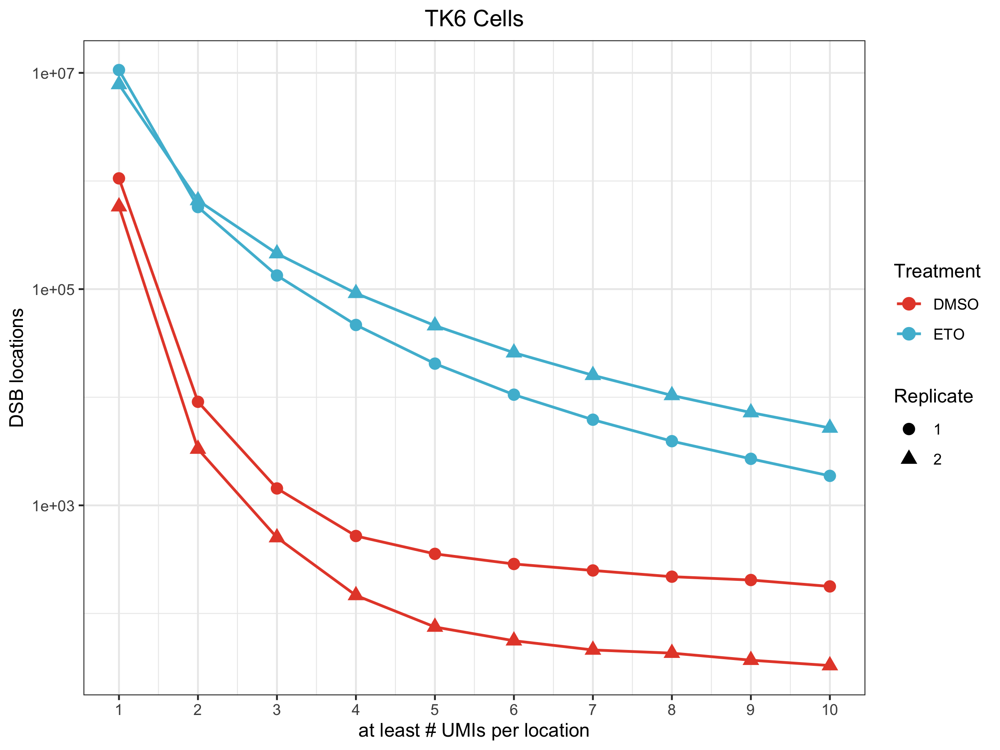
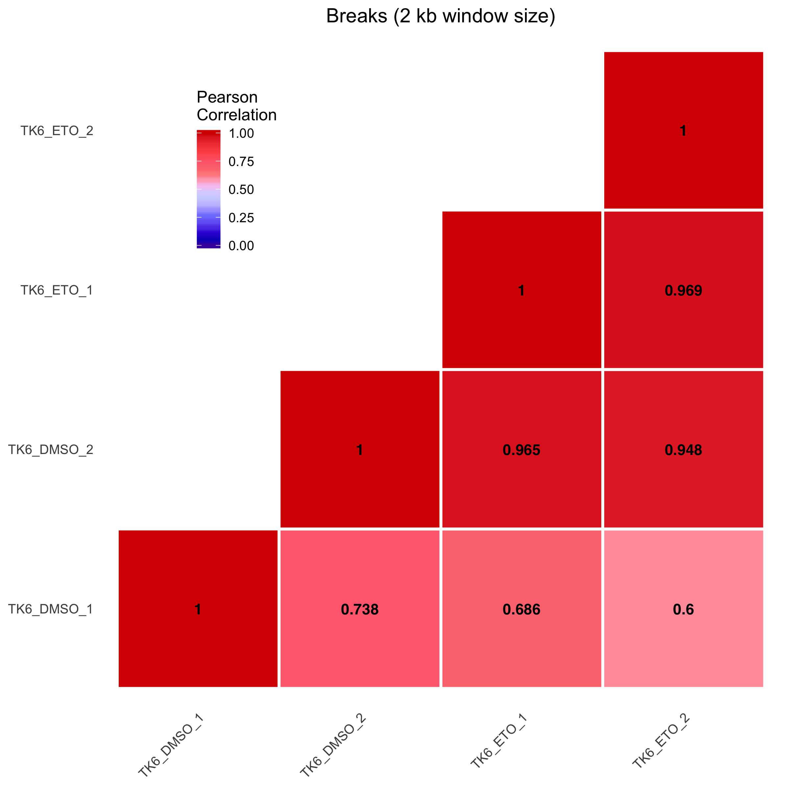

```{r setupEnv, include=FALSE}
working.folder = "./"

knitr::opts_knit$set(root.dir = working.folder)
knitr::opts_chunk$set(echo = TRUE)

if( interactive() )
    setwd(working.folder)
```

Step 1: Load the required packages:

```{r loadPackages, message=FALSE, results="hide"}
require("GenomicFeatures")
require("AnnotationHub")
require("biomaRt")
require("rtracklayer")
require("data.table")
require("knitr")
require("ggplot2")
require("ggpubr")
require("ggsci")
require("circlize")
require("ComplexHeatmap")
```

Step 2: Define some analysis variables and functions:

```{r customFunctions}
# Genome assembly
genome = "hg19"
# ENSEMBL annotation species
species = "hsapiens_gene_ensembl"
# ENSEMBL annotation repository (corresponding to version 75) 
annotation = "http://feb2014.archive.ensembl.org"
# List of blacklisted regions (obtained from 'https://github.com/Boyle-Lab/Blacklist/tree/master/lists')
blacklist = "hg19-blacklist.v2.bed.gz"

chromosomes = c(1:22, "X")

# A countOverlaps function with 'Union' mode, which takes into account the 'score' column
countOverlapsWeighted <- function(query, subject, keepAmbiguous=FALSE){
    overlaps = as.data.table(findOverlaps(query, subject))
    overlaps[, N := .N, by="subjectHits"]
    if( !keepAmbiguous ) # Whether or not to retain reads that overlap multiple features
        overlaps = overlaps[N == 1,]
    setkey(overlaps, subjectHits)
    tmp = data.table(as.data.frame(subject), index = seq_along(subject), key="index")
    overlaps[tmp, score := score/N]
    setkey(overlaps, queryHits)
    overlaps = overlaps[, .(score = sum(score)), by=key(overlaps)]
    tmp = data.table(as.data.frame(query), index = seq_along(query), key="index")
    tmp = merge.data.table(tmp, overlaps, by.x=key(tmp), by.y=key(overlaps), all.x=TRUE)
    tmp[is.na(score), score := 0]
    return(tmp[, score])
}
```

Step 3: Prepare the sample table, which will be our internal reference, and make sure the paths and filenames are correct:

```{r sampleTable}
sampleTable = data.table(name = c("TK6_DMSO_1", "TK6_DMSO_2", "TK6_ETO_1", "TK6_ETO_2"),
                         Batch = c("1", "2", "1", "2"),
                         Treatment = c("DMSO", "DMSO", "ETO", "ETO"),
                         Replicate = c("1", "2", "1", "2"),
                         path=c("./data/BB61_TK6DMSOrep1_CATCACGC_chr-loc-countDifferentUMI.bed.gz",
                                "./data/BB62_TK6DMSOrep2_CATCACGC_chr-loc-countDifferentUMI.bed.gz",
                                "./data/BB61_TK6ETOrep1_GTCGTCGC_chr-loc-countDifferentUMI.bed.gz",
                                "./data/BB62_TK6ETOrep2_GTCGTCGC_chr-loc-countDifferentUMI.bed.gz"))
```

Step 4: Load blacklist regions and sBLISS DSB files:

```{r loadData}
# Load the blacklist file
blacklist = fread(cmd=paste("gunzip -c", blacklist),
                  select=1:3, col.names=c("seqnames", "start", "end"))

# Transform chromosome names, and coordinates to 1-based
blacklist[, `:=`(seqnames = gsub("chr", "", seqnames),  start = start+1, end = end+1)]
setkeyv(blacklist, colnames(blacklist))

# Load the sBLISS samples
data = lapply(with(sampleTable, setNames(path, name)), 
              function(x){
                  tmp = fread(cmd=paste("gunzip -c", x), showProgress=FALSE,
                              col.names=c("seqnames", "start", "end", "score"),
                              colClasses=c("character", "numeric", "numeric", "numeric"))
                  setkeyv(tmp, c("seqnames", "start", "end"))
                  tmp = tmp[seqnames%in%chromosomes,]
                  # Filter out DSBs falling within blacklisted regions
                  tmp2 = fsetdiff(tmp[, 1:3, with=FALSE], blacklist)
                  tmp2[tmp, score := score]
                  return(tmp2)
              })
```

Step 5, plot 1: Calculate the distribution of DSB events at different thresholds (in this example, from 1 to 10):

```{r fig1a}
breaks = 1:10
pl = rbindlist(data, idcol="name")
pl = pl[, lapply(breaks, function(x) .SD[score>=x, .N]), by="name"]
pl = melt.data.table(pl, id.vars="name")
pl[, variable := as.numeric(gsub("V", "", variable))]
pl[, c("Batch", "Treatment", "Replicate") := tstrsplit(name, "_")]

fig1a = ggplot(pl, aes(x=variable, y=value, col=Treatment, shape=Replicate)) +
    ggtitle("TK6 Cells") +
    geom_point(size=3) + geom_line(lwd=0.75) +
    scale_x_continuous("at least # UMIs per location", breaks=breaks) +
    scale_y_log10("DSB locations") +
    scale_colour_npg() +
    theme_bw() + theme(plot.title=element_text(hjust=0.5))
ggsave(fig1a, filename=file.path("images", "fig1a_human.png"), units="in", width=8, height=6, dpi=300)
```

|  |
|:--:| 
| *Plot 1* |

Step 6: Dynamically retrieve from ENSEMBL the chromosome lengths and bin the genome into 2 kb windows:

```{r createGenomicBins}
chrom_sizes = getChromInfoFromBiomart(biomart="ENSEMBL_MART_ENSEMBL", dataset=species, host=annotation)
chrom_sizes = with(chrom_sizes, Seqinfo(seqnames=as.character(chrom), seqlengths=length, isCircular=NA,
                                        genome=genome))
chrom_sizes = keepSeqlevels(chrom_sizes, chromosomes)

# Genome binning
window_size = 1e5
genomic_tiles = tileGenome(seqlengths(chrom_sizes), tilewidth=window_size, cut.last.tile.in.chrom=TRUE)
# Remove bins that are smaller than window size (i.e., the last bin at the end of each chromosome)
genomic_tiles = genomic_tiles[width(genomic_tiles)==window_size]
```

Step 7, plot 2: Step Count the DSB events in each bin and plot the correlation between samples:

```{r, warning=FALSE, message=FALSE}
pl = sapply(data,
            function(x)
                countOverlapsWeighted(genomic_tiles,
                                      with(x, GRanges(seqnames, IRanges(start, width=1), score=score))))

# Correlation using all non-empty bins
pl = cor(pl[rowSums(pl)>0,], method="pearson", use="pairwise.complete.obs")

pl[lower.tri(pl)] = NA

pl = melt.data.table(data.table(pl, keep.rownames = "Row"), id.vars = "Row", variable.name = "Col",
                     value.name = "Value")

pl[, Col := factor(Col, levels = sampleTable[, name])]
pl[, Row := factor(Row, levels = sampleTable[, name])]

fig1b = ggplot(pl, aes(x = Col, y = Row)) +
    ggtitle("Breaks (2 kb window size)") +
    geom_tile(data = subset(pl, !is.na(Value)), aes(fill = Value), col="white", lwd=1) +
    geom_tile(data = subset(pl, is.na(Value)), fill = "white") +
    scale_fill_gsea(name="Pearson\nCorrelation", limits=c(0,1)) +
    geom_text(aes(label=round(Value, 3), family="Helvetica", fontface="bold")) +
    theme_pubclean() +
    theme(plot.title=element_text(hjust=0.5), legend.position=c(0.2, 0.8),
          axis.ticks=element_blank(), panel.grid=element_blank(), axis.title=element_blank(),
          axis.text.x=element_text(angle=45, hjust=1))
ggsave(fig1b, filename=file.path("images", "fig1b_human.png"), units="in", width=8, height=8, dpi=300)
```

|  |
|:--:| 
| *Plot 2* |

```{r, eval=FALSE, include=FALSE}
dir.create("./macs2_input")
dir.create("./macs2_output")

for( i in seq_along(data) ){
    tmp = data[[i]][data[[i]][, rep(.I, score)],]
    fwrite(tmp[, .(seqnames, start, end, ".", "0", "+")],
           file=file.path("./macs2_input", paste0(names(data)[i], ".bed")),
           col.names=FALSE, sep="\t")
}

command = sampleTable[, paste("macs2 callpeak --format BED --outdir macs2_output",
                              "-t", .SD[Treatment=="ETO", file.path("./macs2_input", paste0(name, ".bed"))],
                              "-c", .SD[Treatment=="DMSO", file.path("./macs2_input", paste0(name, ".bed"))],
                              "-n", .SD[Treatment=="ETO", paste0(name, ".bed")],
                              "-g hs --nomodel --keep-dup all"), by="Batch"][, V1]

log = sapply(command, system)
```

Step 8: Dynamically retrieve from ENSEMBL the gene annotation and create the GRanges object:

```{r}
ensembl = useEnsembl(biomart="ENSEMBL_MART_ENSEMBL",
                     dataset=species,
                     host=annotation)
genes <- getBM(attributes=c('chromosome_name','start_position','end_position','strand', 'gene_biotype',
                            'ensembl_gene_id'),
               filters = 'chromosome_name', values = seqnames(chrom_sizes), mart = ensembl)
# Create the GRanges object
genes_gr = with(genes, GRanges(chromosome_name, IRanges(start_position, end_position),
                               strand = ifelse(strand>0, "+", "-"), biotype=gene_biotype,
                               gene_id = ensembl_gene_id))
```


Step 9, plot 3: Calculate the distribution of DSB events across genic and intergenic portions of the genome:

```{r}
pl = sapply(data,
            function(x)
                countOverlapsWeighted(genes_gr,
                                      with(x, GRanges(seqnames, IRanges(start, width=1), score=score)),
                                      keepAmbiguous=TRUE))
pl = data.table(as.data.frame(genes_gr), pl)

pl = melt.data.table(pl, id.vars="biotype", measure.vars=sampleTable[, name])

# Collapse the counts by biotype
pl = pl[, .(value = sum(value)), by=c("variable", "biotype")]

# Add the promoter and intergenic counts
pl_extra = rbindlist(lapply(seq_along(data),
                            function(i){
                                tmp = with(data[[i]], GRanges(seqnames, IRanges(start, width=1), 
                                                              score=score))
                                tmp = tmp[!overlapsAny(tmp, genes_gr),]
                                prom = promoters(genes_gr, upstream=2e3, downstream=1)
                                count = sum(countOverlapsWeighted(prom, tmp))
                                data.table(variable = names(data)[i],
                                           biotype = c("promoter", "intergenic"),
                                           value = as.numeric(c(count, sum(tmp$score)-count)))
                            }))

pl = rbindlist(list(pl, pl_extra))

# Calculate the fractions per dataset 
pl[, percentage := value/sum(value), by="variable"]

# Collapse the minor biotypes into the 'other' group
pl[!biotype%in%c("promoter", "intergenic"), biotype := "gene"]

pl = pl[, .(value=sum(value), percentage=sum(percentage)), by=c("variable", "biotype")]

pl[, biotype := factor(biotype, levels=c("promoter", "gene", "intergenic"))]

pl[order(biotype), position := cumsum(percentage)- 0.5*percentage, by="variable"]

fig1c = ggplot(pl, aes(x=as.factor(1), y=percentage, fill=biotype)) +
    geom_bar(stat="identity", position="stack", col="black") +
    scale_fill_npg(name="") +
    geom_text(aes(y=1-position, label=paste0(round(percentage*100, 1), "%"), x=1.7)) +
    facet_wrap(~variable) +
    theme_void() +
    coord_polar(theta="y", direction=-1)
ggsave(fig1c, filename=file.path("images", "fig1c_human.png"), units="in", width=10, height=8, dpi=300)
```

|  |
|:--:| 
| *Plot 3* |

Step 10, plot 4: Visualise the density of DSB events across the genome:

```{r, results='hide'}
genomic_tiles = tileGenome(seqlengths(chrom_sizes), tilewidth=1e6, cut.last.tile.in.chrom=TRUE)

pl = lapply(data,
            function(x)
                data.table(as.data.frame(genomic_tiles),
                           count = countOverlapsWeighted(genomic_tiles,
                                                         with(x, GRanges(seqnames,
                                                                         IRanges(start, width=1),
                                                                         score=score)))))

pl = lapply(pl,
            function(x){
                M = mean(x[, count])
                SD = sd(x[, count])
                x[, value := count]
                x[value>(M+3*SD), value := (M+3*SD)]
                return(x[, .(chr=paste0("chr", seqnames), start, end, value)])
            })


png(filename=file.path("images", "fig1d_human.png"), units="in", width=8, height=8, res=300)
    sel_col = get_palette("Paired", nrow(sampleTable))
    lab_col = c()
    toplim = ceiling(max(sapply(pl, function(x) x[, max(value)]))/1e3)*1e3
    i = 1
    circos.initializeWithIdeogram(species = genome, chromosome.index = paste0("chr", chromosomes))
    for( batch in sampleTable[, unique(Batch)] ){
        circos.track(factors=paste0("chr", chromosomes), ylim=c(0, toplim), track.height = 0.15)
        ii = 1
        for( id in sampleTable[Batch==batch, name] ){
            for( chrom in pl[[id]][, unique(chr)] )
                circos.genomicLines(region=pl[[id]][chr==chrom,], value=pl[[id]][chr==chrom,],
                                    numeric.column=4, col = sel_col[2*(i-1)+ii], track.index=i+2,
                                    sector.index=chrom)
            ii = ii+1
            treatment = paste(strsplit(id, "_")[[1]][2:3], collapse="_")
            lab_col = append(lab_col, treatment)
        }
        i = i+1
    }
    text(0, 0, "TK6\nDSBs Genomic Profile", cex = 0.8)
    lgd_lines = Legend(at = lab_col, type = "lines", 
                       legend_gp = gpar(col = sel_col, lwd = 2, fill="white"),
                       direction = "horizontal", nrow = 1)
    draw(packLegend(lgd_lines), y = unit(6, "mm"), just = "center")
    circos.clear()
dev.off()
```

|  |
|:--:| 
| *Plot 4* |
